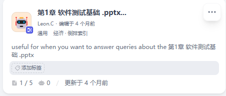

# 多模态AI互动式教学智能体



本项目旨在构建一个**多模态AI互动式教学智能体**，其核心是开发一个以教师教学思路为驱动、具备深度互动与多模态解析与生成能力的课件共创系统。该智能体旨在将教师从繁琐的课件制作中解放出来，使其能够专注于教学逻辑与创意的构思，从而推动教育数字化向深层次发展。

## ✨ 功能概览

该智能体提供以下核心功能，旨在全面提升教师备课效率与教学质量：

-   **智能意图理解**：通过自然语言（语音/文字）与教师进行多轮对话，主动澄清模糊需求，精准把握教学目标、知识点、讲授逻辑、重点难点及互动设计思路。
-   **多模态参考融合**：支持上传多种格式的参考资料（如PDF教案、Word文档、参考视频片段、图片等），智能体能从中提取关键信息并融入课件生成过程。
-   **课件初稿生成**：基于深度理解的教学意图和参考资料，自动生成结构完整、内容丰富的多模态课件初稿，包括PPT演示文稿和Word教案文档。
-   **内容生成多样性**：根据教师要求生成知识点相关的动画创意、互动小游戏等，丰富教学形式。
-   **迭代优化与导出**：提供课件预览界面，教师可提出修改意见，智能体进行调整再生，并支持将最终课件导出为标准格式（.pptx, .docx）。
-   **本地知识库RAG**：集成本地知识库，利用大模型检索增强技术实现文本处理、向量化与检索，为教学内容提供丰富支撑。

## 🚀 快速开始

本项目包含前端和后端两部分。请按照以下步骤启动项目：

### 前端 (teacher-platform)

前端项目基于 Vue 3 + Vite 构建。

```bash
# 进入前端项目目录
cd teacher-platform

# 安装依赖
npm install

# 启动开发服务器
npm run dev

# 构建生产版本
npm run build
```

### 后端 (backend)

后端项目基于 FastAPI 构建，提供核心AI服务和API接口。

```bash
# 进入后端项目目录
cd backend

# 安装依赖 (推荐使用 pipenv 或 poetry 管理虚拟环境)
pip install -r requirements.txt

# 启动开发服务器
python run.py
# 或者使用 uvicorn 直接启动
uvicorn app.main:app --host 0.0.0.0 --port 8000 --reload
```

## 🛠️ 技术栈

### 前端

-   **框架**: Vue 3
-   **构建工具**: Vite
-   **状态管理**: Pinia
-   **路由**: Vue Router 4

### 后端

-   **Web框架**: FastAPI
-   **异步ORM**: SQLAlchemy (asyncio)
-   **数据库**: PostgreSQL (通过 asyncpg)
-   **缓存/消息队列**: Redis, Celery
-   **数据校验**: Pydantic
-   **认证**: python-jose (JWT)
-   **其他**: httpx, playwright, alembic (数据库迁移)

### AI/多模态技术

-   **大语言模型**: 集成多种大语言模型用于意图理解、对话交互和内容生成。
-   **RAG**: 检索增强生成技术，结合本地知识库进行内容检索与生成。
-   **多模态处理**: 支持PDF、Word、视频、图片等多种格式的资料解析与信息提取。

## 📂 项目结构

```
. # 项目根目录
├── backend/              # 后端服务 (FastAPI)
│   ├── app/              # FastAPI 应用核心代码
│   │   ├── api/          # API 路由定义
│   │   ├── core/         # 核心配置与工具
│   │   ├── generators/   # 内容生成模块 (如 PPT 生成)
│   │   ├── models/       # 数据库模型
│   │   ├── services/     # 业务逻辑服务 (包含 AI, RAG, 数据分析等)
│   │   └── main.py       # FastAPI 应用入口
│   ├── alembic/          # 数据库迁移工具
│   ├── chroma_data/      # ChromaDB 数据存储
│   ├── media/            # 静态文件存储 (如生成的课件)
│   ├── pyproject.toml    # Python 项目依赖配置
│   └── requirements.txt  # Python 依赖列表
├── teacher-platform/     # 前端应用 (Vue 3 + Vite)
│   ├── public/           # 静态资源
│   ├── src/              # 前端源代码
│   │   ├── components/   # 公共组件
│   │   ├── views/        # 页面组件
│   │   ├── stores/       # Pinia 状态管理
│   │   └── router/       # Vue Router 配置
│   └── package.json      # 前端项目依赖配置
├── docs/                 # 项目文档与设计稿
├── example.png           # 示例图片
├── 赛题信息.md           # 赛题详细说明
└── README.md             # 本文件
```

## 📚 API 端点

后端提供丰富的 API 接口，主要分类如下：

| 类别         | 描述                                     | 示例端点                                    |
| :----------- | :--------------------------------------- | :------------------------------------------ |
| **认证**     | 用户登录、注册、会话管理                 | `/api/v1/auth/...`                          |
| **教案管理** | 生成、修改、获取教案列表与详情           | `/api/v1/lesson-plan/generate`              |
| **课件管理** | 课件列表、上传、导出                     | `/api/v1/courseware/...`                    |
| **知识库**   | RAG 文档管理、来源映射、知识库容量       | `/api/v1/knowledge/...`                     |
| **聊天**     | 对话式交互、历史会话                     | `/api/v1/chat/...`                          |
| **数据分析** | 教学数据分析                             | `/api/v1/data-analysis/...`                 |
| **PPT生成**  | 自动生成PPT演示文稿                      | `/api/v1/ppt/generate`                      |
| **资源搜索** | 外部资源搜索与整合                       | `/api/v1/resource-search/...`               |
| **上传**     | 文件上传服务                             | `/api/v1/upload/...`                        |
| **数字人**   | 数字人相关功能                           | `/api/v1/digital-human/...`                 |
| **排练**     | 教学排练相关功能                         | `/api/v1/rehearsal/...`                     |

> [!NOTE]
> 完整的 API 文档可在后端服务启动后访问 `/doc.html` 或 `/redoc.html` 查看。

## 🌟 项目背景

本项目是针对“服务外包大赛 A04 赛题”——**多模态AI互动式教学智能体**的解决方案。随着教育信息化2.0的深入，AI技术在教学领域的应用日益广泛。然而，现有AI辅助教学工具普遍存在功能单一、操作割裂、难以深度理解教师意图等问题。本项目旨在通过融合生成式AI和多模态理解技术，构建一个以教师教学思路为核心的智能辅助系统，赋能教师，使其从繁琐的重复性工作中解脱，专注于教学设计与创新。

## 🎯 用户期望

该智能体致力于将教师从“事务型”工作者转变为“设计型”导师，实现以下用户期望：

-   **减负增效**：将课件制作时间从数小时缩短至分钟级，极大降低技术操作门槛。
-   **思路聚焦**：教师可将精力完全集中于教学设计和内容质量本身，而非形式制作。
-   **个性化满足**：智能体能够充分理解并实现其独特的教学风格和特定要求，生成“量身定制”的课件。
-   **提升质量**：通过融合优质参考资料和AI的创造性，产出内容更精准、形式更生动的课件。
-   **促进创新**：降低复杂互动、动画等形式的设计成本，鼓励教师尝试更多元化的教学方法。

## 🤝 贡献

欢迎对本项目进行贡献！如果您有任何建议或发现Bug，请随时提交Issue或Pull Request。

## 许可证

本项目采用 MIT 许可证。详情请参阅 `LICENSE` 文件。
