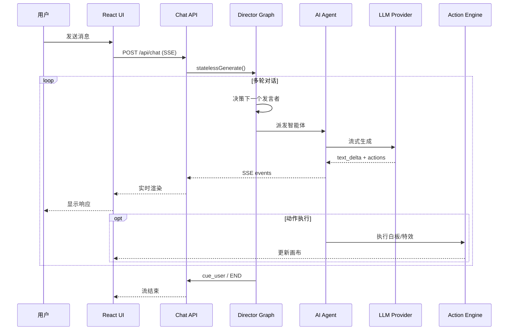

# openclaw介绍：

- **项目是什么：** 一个开源的 AI 多智能体互动课堂平台，可将任何主题或文档转化为沉浸式的互动学习体验
- **解决什么问题：** 解决在线教育缺乏互动性、个性化不足的问题，通过多智能体编排实现 AI 教师和 AI 同学的实时互动教学
- 使用场景：
  1. 在线教育与培训（企业内训、学校课程）
  2. 个人学习助手（快速学习新知识领域）
  3. 会议演示与知识分享（自动生成演示文稿）
- 最大亮点：
  1. **LangGraph 多智能体编排** — 使用状态机实现复杂的智能体协作逻辑
  2. **双阶段生成管道** — 大纲生成 + 场景内容生成的分层架构
  3. **28+ 动作类型** — 支持语音、白板、特效等丰富的课堂互动

## 基本信息：

| 主语言       | TypeScript (100%) |
| ------------ | ----------------- |
| 框架版本     | Next.js 16.1.2    |
| React 版本   | 19.2.3            |
| Node.js 要求 | >= 20.9.0         |
| 包管理器     | pnpm 10.28.0      |
|              |                   |

```
运行时:     Node.js 20+ (推荐 22+)
框架:       Next.js 16.1.2 (App Router)
前端:       React 19.2.3 + TypeScript 5
状态管理:   Zustand 5.0.10
样式:       Tailwind CSS 4
AI 编排:    LangGraph 1.1 + Vercel AI SDK 6
数据库:     Dexie (IndexedDB) - 本地存储
构建:       Next.js 内置 (Turbopack)
部署:       Docker + Vercel
```

## 仓库结构：

```
OpenMAIC-main/
├── app/                        # Next.js App Router
│   ├── api/                    #   服务端 API 路由 (~25 个端点)
│   │   ├── generate/           #     场景生成管道
│   │   │   ├── scene-outlines-stream/  # 大纲流式生成
│   │   │   ├── scene-content/  #     场景内容生成
│   │   │   ├── scene-actions/  #     动作序列生成
│   │   │   ├── agent-profiles/ #     智能体配置生成
│   │   │   ├── image/          #     图像生成
│   │   │   ├── video/          #     视频生成
│   │   │   └── tts/            #     语音合成
│   │   ├── generate-classroom/ #     异步课堂生成任务
│   │   ├── chat/               #     多智能体对话 (SSE 流式)
│   │   ├── pbl/                #     项目式学习端点
│   │   ├── parse-pdf/          #     PDF 解析
│   │   ├── quiz-grade/         #     测验评分
│   │   ├── web-search/         #     网络搜索
│   │   └── transcription/      #     语音识别
│   ├── classroom/[id]/         #   课堂播放页面
│   ├── generation-preview/      #   生成预览页面
│   ├── layout.tsx              #   根布局
│   └── page.tsx                #   首页 (课程生成入口)
│
├── lib/                        # 核心业务逻辑
│   ├── generation/             #   双阶段生成管道
│   │   ├── outline-generator.ts      # 大纲生成
│   │   ├── scene-generator.ts        # 场景生成
│   │   ├── scene-builder.ts          # 场景构建
│   │   ├── pipeline-runner.ts        # 管道执行器
│   │   └── action-parser.ts          # 动作解析
│   │
│   ├── orchestration/          #   LangGraph 多智能体编排
│   │   ├── director-graph.ts         # 状态机图定义
│   │   ├── director-prompt.ts        # 导演决策提示
│   │   ├── prompt-builder.ts         # 提示构建器
│   │   ├── tool-schemas.ts           # 工具模式定义
│   │   └── stateless-generate.ts     # 无状态生成
│   │
│   ├── playback/               #   播放引擎
│   │   ├── engine.ts                 # 状态机 (idle→playing→live)
│   │   └── types.ts                  # 播放类型定义
│   │
│   ├── action/                 #   动作执行引擎
│   │   └── engine.ts                 # 28+ 动作执行器
│   │
│   ├── ai/                     #   LLM 提供商抽象
│   │   ├── providers.ts              # 统一提供商配置
│   │   ├── llm.ts                    # LLM 调用封装
│   │   └── thinking-context.ts       # 思考模式上下文
│   │
│   ├── api/                    #   Stage API 门面
│   │   ├── stage-api.ts              # 统一 API 入口
│   │   ├── stage-api-canvas.ts       # 画布操作
│   │   ├── stage-api-whiteboard.ts   # 白板操作
│   │   └── stage-api-element.ts      # 元素操作
│   │
│   ├── store/                  #   Zustand 状态存储
│   │   ├── canvas.ts                 # 画布状态
│   │   ├── stage.ts                  # 舞台状态
│   │   ├── settings.ts               # 设置状态
│   │   └── snapshot.ts               # 快照状态
│   │
│   ├── audio/                  #   音频处理
│   │   ├── tts-providers.ts          # TTS 提供商
│   │   └── asr-providers.ts          # ASR 提供商
│   │
│   ├── media/                  #   媒体生成
│   │   ├── image-providers.ts        # 图像生成
│   │   ├── video-providers.ts        # 视频生成
│   │   └── media-orchestrator.ts     # 媒体编排器
│   │
│   ├── export/                 #   导出功能
│   │   ├── use-export-pptx.ts        # PPTX 导出
│   │   └── html-parser/              # HTML 解析
│   │
│   ├── pbl/                    #   项目式学习
│   │   ├── types.ts                  # PBL 类型定义
│   │   ├── generate-pbl.ts           # PBL 生成
│   │   └── mcp/                      # MCP 工具
│   │
│   ├── types/                  #   TypeScript 类型定义
│   │   ├── stage.ts                  # 舞台/场景类型
│   │   ├── action.ts                 # 动作类型 (28+)
│   │   ├── slides.ts                 # 幻灯片类型
│   │   ├── chat.ts                   # 聊天类型
│   │   └── provider.ts               # 提供商类型
│   │
│   ├── i18n/                   #   国际化
│   │   ├── index.ts                  # i18n 入口
│   │   ├── zh.ts                     # 中文
│   │   └── en.ts                     # 英文
│   │
│   └── hooks/                  #   React 自定义 Hooks (55+)
│
├── components/                 # React UI 组件
│   ├── slide-renderer/         #   Canvas 幻灯片渲染器
│   │   ├── Editor/             #     编辑画布
│   │   └── components/element/ #     元素渲染器
│   │
│   ├── scene-renderers/        #   场景渲染器
│   │   ├── QuizRenderer.tsx          # 测验渲染
│   │   ├── InteractiveRenderer.tsx   # 互动渲染
│   │   └── PBLRenderer.tsx           # PBL 渲染
│   │
│   ├── generation/             #   生成工具栏和进度
│   ├── chat/                   #   聊天区域
│   ├── settings/               #   设置面板
│   ├── whiteboard/             #   SVG 白板
│   ├── agent/                  #   智能体头像和配置
│   ├── roundtable/             #   圆桌讨论
│   ├── ai-elements/            #   AI 交互元素
│   └── ui/                     #   基础 UI 组件 (shadcn/ui)
│
├── packages/                   # 工作区包
│   ├── pptxgenjs/              #   定制的 PPT 生成库
│   └── mathml2omml/            #   MathML → Office Math 转换
│
├── skills/                     # OpenClaw 技能
│   └── openmaic/               #   消息应用集成 SOP
│
├── configs/                    # 共享配置
│   ├── animation.ts            #   动画配置
│   ├── shapes.ts               #   形状定义
│   ├── font.ts                 #   字体配置
│   └── theme.ts                #   主题配置
│
├── public/                     # 静态资源
│   └── logos/                  #   AI 提供商图标
│
├── .env.example                # 环境变量模板
├── package.json                # 项目配置
├── tsconfig.json               # TypeScript 配置
├── tailwind.config.ts          # Tailwind 配置
└── docker-compose.yml          # Docker 部署配置
```

##  状态管理架构

**Zustand Stores：**

| Store                   | 文件                            | 职责                 |
| ----------------------- | ------------------------------- | -------------------- |
| useCanvasStore          | `lib/store/canvas.ts`           | 画布状态、白板、特效 |
| useStageStore           | `lib/store/stage.ts`            | 舞台、场景列表       |
| useSettingsStore        | `lib/store/settings.ts`         | 用户设置、提供商配置 |
| useSnapshotStore        | `lib/store/snapshot.ts`         | 播放快照             |
| useMediaGenerationStore | `lib/store/media-generation.ts` | 媒体生成任务状态     |

## 核心功能 ：动作执行引擎

**支持的 28+ 动作类型：**

| 类别         | 动作                | 说明             |
| ------------ | ------------------- | ---------------- |
| **即时特效** | spotlight, laser    | 元素高亮、激光笔 |
| **语音**     | speech              | AI 讲师旁白      |
| **白板**     | wb_open, wb_close   | 白板开关         |
|              | wb_draw_text        | 绘制文本         |
|              | wb_draw_shape       | 绘制形状         |
|              | wb_draw_chart       | 绘制图表         |
|              | wb_draw_latex       | 绘制公式         |
|              | wb_draw_table       | 绘制表格         |
|              | wb_draw_line        | 绘制线条/箭头    |
|              | wb_clear, wb_delete | 清除/删除        |
| **视频**     | play_video          | 播放视频元素     |
| **讨论**     | discussion          | 触发讨论         |

**执行模式：**

- **Fire-and-forget**：spotlight, laser → 立即返回，不阻塞
- **Synchronous**：speech, wb_* → 等待完成后再执行下一个

## 5：核心功能解析

### 5.1 功能矩阵

| 功能         | 重要性 | 实现文件                                         | 完成度 |
| ------------ | ------ | ------------------------------------------------ | ------ |
| 课程生成     | 🔴 核心 | `lib/generation/`                                | ✅ 完整 |
| 多智能体对话 | 🔴 核心 | `lib/orchestration/`                             | ✅ 完整 |
| 幻灯片渲染   | 🔴 核心 | `components/slide-renderer/`                     | ✅ 完整 |
| 白板演示     | 🔴 核心 | `components/whiteboard/`, `lib/action/engine.ts` | ✅ 完整 |
| 语音合成     | 🟡 重要 | `lib/audio/tts-providers.ts`                     | ✅ 完整 |
| 测验评分     | 🟡 重要 | `app/api/quiz-grade/`                            | ✅ 完整 |
| 项目式学习   | 🟡 重要 | `lib/pbl/`                                       | ✅ 完整 |
| 网络搜索     | 🟢 增强 | `app/api/web-search/`                            | ✅ 完整 |
| 视频生成     | 🟢 增强 | `lib/media/video-providers.ts`                   | ⚠️ 部分 |
| PDF 解析     | 🟢 增强 | `app/api/parse-pdf/`                             | ✅ 完整 |

### 5.2 核心功能 #1：双阶段课程生成

**调用链：**

```
用户输入主题/文档
  └── POST /api/generate-classroom
      └── createGenerationSession()           [lib/generation/pipeline-runner.ts]
          └── Stage 1: generateSceneOutlinesFromRequirements()
              │   [lib/generation/outline-generator.ts]
              │   └── LLM → JSON 大纲列表
              │
              └── Stage 2: generateFullScenes()
                  │   [lib/generation/scene-generator.ts]
                  │   └── 并行生成每个场景
                  │       ├── generateSceneContent() → 幻灯片/测验/互动内容
                  │       └── generateSceneActions() → 动作序列 (语音/白板/特效)
                  │
                  └── TTS 后处理：为每个 speech 动作生成音频
```

**关键代码片段：**

```typescript
// lib/generation/pipeline-runner.ts
export async function runGenerationPipeline(
  session: GenerationSession,
  callbacks: GenerationCallbacks,
): Promise<GenerationResult> {
  // Stage 1: Generate outlines
  const outlines = await generateSceneOutlinesFromRequirements(
    session.userRequirements,
    session.agents,
    session.languageModel,
    { onProgress: callbacks.onOutlineProgress }
  );

  // Stage 2: Generate scene content in parallel
  const scenes = await generateFullScenes(
    outlines,
    session,
    { onSceneProgress: callbacks.onSceneProgress }
  );

  return { scenes, outlines };
}
```

**设计决策：**

- 大纲生成确保整体结构一致性
- 场景内容并行生成提高效率
- 动作序列与内容分离，便于回放

### 5.3 核心功能 #2：多智能体对话

**调用链：**

```
POST /api/chat (SSE)
  └── statelessGenerate()                      [lib/orchestration/stateless-generate.ts]
      └── createOrchestrationGraph().stream()  [lib/orchestration/director-graph.ts]
          │
          ├── directorNode() 决策
          │   ├── 单智能体：代码逻辑
          │   └── 多智能体：LLM 决策下一个发言者
          │
          └── agentGenerateNode() 生成
              └── buildStructuredPrompt() → LLM Stream
                  └── parseStructuredChunk() 解析文本 + 动作
                      └── SSE 推送事件
                          ├── agent_start
                          ├── text_delta
                          ├── action
                          └── agent_end
```

**关键代码片段：**

```typescript
// lib/orchestration/director-graph.ts
async function directorNode(state, config) {
  // Turn limit check
  if (state.turnCount >= state.maxTurns) {
    return { shouldEnd: true };
  }

  // Single agent: code-only logic
  if (isSingleAgent) {
    if (state.turnCount === 0) {
      return { currentAgentId: agentId, shouldEnd: false };
    }
    write({ type: 'cue_user', data: { fromAgentId: agentId } });
    return { shouldEnd: true };
  }

  // Multi agent: LLM-based decision
  const decision = await llm.generate(buildDirectorPrompt(...));
  if (decision.nextAgentId === 'USER') {
    write({ type: 'cue_user', data: {} });
    return { shouldEnd: true };
  }
  return { currentAgentId: decision.nextAgentId, shouldEnd: false };
}
```

### 5.4 核心功能 #3：动作执行引擎

**支持的 28+ 动作类型：**

| 类别         | 动作                | 说明             |
| ------------ | ------------------- | ---------------- |
| **即时特效** | spotlight, laser    | 元素高亮、激光笔 |
| **语音**     | speech              | AI 讲师旁白      |
| **白板**     | wb_open, wb_close   | 白板开关         |
|              | wb_draw_text        | 绘制文本         |
|              | wb_draw_shape       | 绘制形状         |
|              | wb_draw_chart       | 绘制图表         |
|              | wb_draw_latex       | 绘制公式         |
|              | wb_draw_table       | 绘制表格         |
|              | wb_draw_line        | 绘制线条/箭头    |
|              | wb_clear, wb_delete | 清除/删除        |
| **视频**     | play_video          | 播放视频元素     |
| **讨论**     | discussion          | 触发讨论         |

**执行模式：**

- **Fire-and-forget**：spotlight, laser → 立即返回，不阻塞
- **Synchronous**：speech, wb_* → 等待完成后再执行下一个

---

## 🌊 第六章：数据流与状态管理

### 6.1 核心数据模型

```
erDiagram
    Stage ||--o{ Scene : "contains"
    Stage { string id, string name, string description, datetime createdAt }

    Scene ||--o| SlideContent : "slide"
    Scene ||--o| QuizContent : "quiz"
    Scene ||--o| InteractiveContent : "interactive"
    Scene ||--o| PBLContent : "pbl"
    Scene { string id, string stageId, enum type, string title, int order }

    Scene ||--o{ Action : "executes"
    Action { string id, enum type, json params }

    Scene ||--o{ Whiteboard : "explains"
    Whiteboard { string id, json elements }

    Agent { string id, string name, string role, string[] allowedActions }
```

### 6.2 主要请求时序图



### 6.3 状态管理架构

**Zustand Stores：**

| Store                   | 文件                            | 职责                 |
| ----------------------- | ------------------------------- | -------------------- |
| useCanvasStore          | `lib/store/canvas.ts`           | 画布状态、白板、特效 |
| useStageStore           | `lib/store/stage.ts`            | 舞台、场景列表       |
| useSettingsStore        | `lib/store/settings.ts`         | 用户设置、提供商配置 |
| useSnapshotStore        | `lib/store/snapshot.ts`         | 播放快照             |
| useMediaGenerationStore | `lib/store/media-generation.ts` | 媒体生成任务状态     |